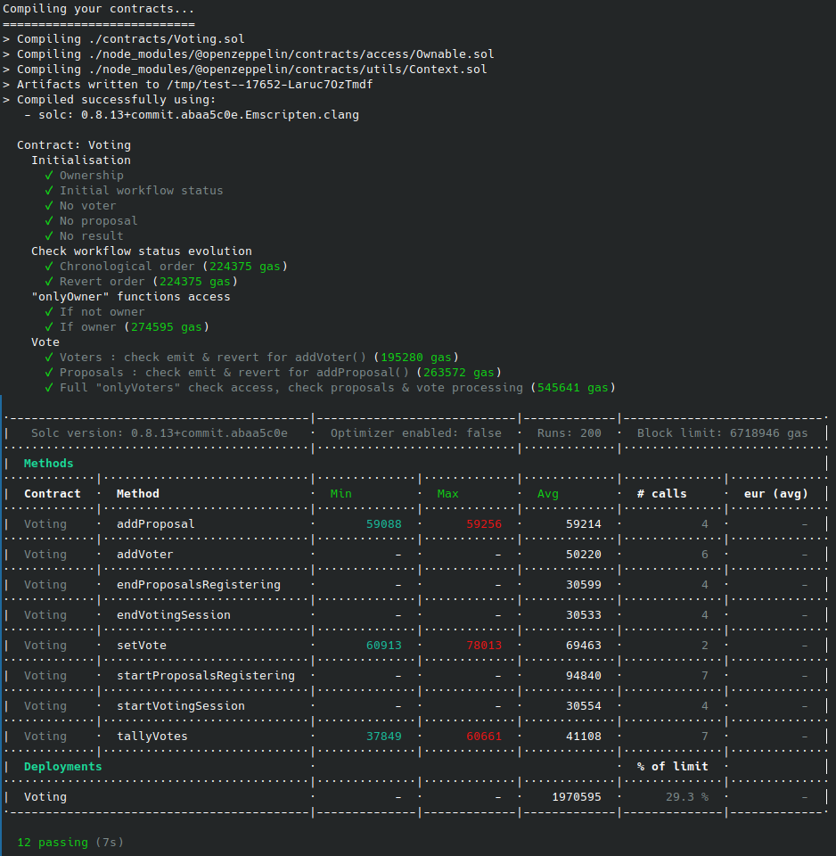

## Projet #2 - Système de vote (test unit)

### Enoncé


Oui oui, nous allons repartir du défi “Système de vote” ! 

Vous repartirez du smart contract proposé en correction 

Depuis la dernière version, vous avez vu la partie CI/CD avec les tests et le déploiement. 

Vous devez alors fournir les tests unitaires de votre smart contract Nous n’attendons pas une couverture à 100% du smart contract mais veillez à bien tester les différentes possibilités de retours (event, revert).

**A rendre :**

- votre lien Github (tests et explication rapide de ce qui a été fait dans un readme.md


**Lien énoncé :** [https://formation.alyra.fr/products/developpeur-blockchain/categories/2149101531/posts/2153206159](https://formation.alyra.fr/products/developpeur-blockchain/categories/2149101531/posts/2153206159)

**Script initial :** [https://github.com/BenBktech/Promo-Buterin/blob/main/1.Solidity/Voting.sol](https://github.com/BenBktech/Promo-Buterin/blob/main/1.Solidity/Voting.sol)


### Constantes

Afin de gagner en lisibilité de lecture du script de test, différentes constantes sont définies.

Les différents états du **Workflow** sont définis ainsi :

##### Extrait :

```javascript
const RegisteringVoters            = BN(0);
const ProposalsRegistrationStarted = BN(1);
const ProposalsRegistrationEnded   = BN(2);
const VotingSessionStarted         = BN(3);
const VotingSessionEnded           = BN(4);
const VotesTallied                 = BN(5);
```

Les différentes adresses utilisées dans le script de test, sont aussi définies de manière explicites.

#### Extrait :

```javascript
const OWNER   = accounts[0];
const VOTER_1 = accounts[1];
const VOTER_2 = accounts[2];
const VOTER_3 = accounts[3];
```

Ainsi que différents indexs de proposition et autre constante.

##### Extrait :

```javascript
const INDEX_GENESIS         = BN(0);
const INDEX_PROPOSAL_1      = BN(1);
const INDEX_PROPOSAL_WINNER = BN(1);
const NN_VOTE               = BN(2);
```


### Les différents vecteurs d'états

On peut noter les principaux **vecteurs d'états** dans le code du fichier source "*Voting.sol*"

- WorkflowStatus
- onlyOwner
- onlyVoters

Ainsi que les **variables** qui évoluent en fonctions du déroulement du processus de vote et des intéractions réalisées par le "*owner*" et les votants.

- winningProposalID
- proposalsArray
- voters

Le cas **proposalsArray** est intéressant car à partir du passage à l'étape **ProposalsRegistrationStarted** du déroulement du processus de vote (workflow) il y a au moins **une** proposition, la proposition **GENESIS**, il y a donc un état testable !

##### Extrait :
```javascript
let proposalStruct = await voting.getOneProposal(0, {from: _voter1});
assert.equal(proposalStruct.description, "GENESIS",  "Not GENESIS proposal");
```


### Factorisation

Des fonctions ont été également réalisées afin de "regrouper" des contrôles multiples autour de certaines fonctionalités ou processus comme :

- Les changements d'état dans l'**évolution du processus de vote**.
  - exceptDefinedStatus()
  - expectStatusChangeOk()
  - expectStatusScheduling()
  
- L'**ajout d'un votant** :
  - expectAddNewVoter

- Une fonction "*couteau suisse*" **checkGetVoterAndGetProposal()** éffectuant des contrôles sur un votant et la proposition votée, selon :
  - Qu'une proposition de vote soit disponible ou pas
  - Qu'un votant ait voté pour une proposition donnée


##### Extraits :

```javascript
async function exceptDefinedStatus( _voting, _status) {
	workflowStatus = (await _voting.workflowStatus());
	expect(workflowStatus).to.be.bignumber.equal(_status);
}

async function expectStatusChangeOk( _voting, _prevStatus, _newStatus, _func) {
	expectEvent(
		_func,
		"WorkflowStatusChange", {
			previousStatus: _prevStatus,
			newStatus     : _newStatus,
		}
	);
	exceptDefinedStatus( _voting, _newStatus);
}
```

```javascript
async function expectAddNewVoter( _voting, _address, _owner) {
	expectEvent(
		await _voting.addVoter( _address, {from: _owner}),
		"VoterRegistered",
		{voterAddress: _address}
	);

	voterStruct = await _voting.getVoter( _address, {from: _address});
	expect(voterStruct.isRegistered).to.be.true;
	expect(voterStruct.hasVoted).to.be.false;
	expect(voterStruct.votedProposalId).to.be.bignumber.equal( BN(0));

}
```


### Déploiement

Au déploiement du **contrat**, celui-ci : 
- ne possède ni votant
- ne possède ni proposition de vote
- ne possède ni résultat de vote
- il est juste "*possédé*" par le **owner** qui l'a déployé
- l'état initiale du Workflow est **RegisteringVoters**

##### Extrait :
```javascript
it("Ownership", async () => {
	expect( await voting.owner()).to.be.bignumber.equal( BN(OWNER));
});

it("Initial workflow status", async () => {
	exceptDefinedStatus( voting, RegisteringVoters);
});

it("No voter", async () => {
	await expectRevert(
		voting.getVoter(OWNER, {from: OWNER}),
		"You're not a voter"
	);

	await expectRevert(
		voting.getVoter(VOTER_1, {from: OWNER}),
		"You're not a voter"
	);

});

it("No proposal", async () => {
	// No registered voter, so no access to getOneProposal()
	await expectRevert(
		voting.getOneProposal(0, {from: OWNER}),
		"You're not a voter"
	);
	await expectRevert(
		voting.getOneProposal(0, {from: VOTER_1}),
		"You're not a voter"
	);

});

it("No result", async () => {

	// No result !
	await expectRevert(
		voting.tallyVotes( {from: OWNER}),
		"Current status is not voting session ended"
	);

	let winningProposalID = (await voting.winningProposalID( {from: OWNER}));
	expect(winningProposalID).to.be.bignumber.equal(BN(0));

});
```


### Évolution du processus de vote

Le déroulement du processus de vote, se fait dans une ordre bien défini, de *RegisteringVoters* vers *VotesTallied* (voir tableau plus bas) un **revert** se porduit en cas de mauvais enchainement d'états.

Des **events** précis sont émis lors du changement d'étape.

##### Les étapes du déroulement du vote sont les suivantes :

| WorkflowStatus               | Descriptions                 |
| ---------------------------- | ---------------------------- |
| RegisteringVoters            | Enregistrement des électeurs |
| ProposalsRegistrationStarted | On récolte les propositions  |
| ProposalsRegistrationEnded   | On clos les propositions     |
| VotingSessionStarted         | Le vote est commencé         |
| VotingSessionEnded           | Le vote est clos             |
| VotesTallied                 | Le dépouillement est fait    |

##### Extrait #1 :
```javascript
expectEvent(
	await voting.startProposalsRegistering(),
	"WorkflowStatusChange", {
		previousStatus: RegisteringVoters,
		newStatus     : ProposalsRegistrationStarted,
	}
);
```
##### Extrait #2 :
```javascript
await expectRevert(
	voting.endVotingSession(),
	"Voting session havent started yet"
);
```


### onlyOwner

Les fonctions en accès onlyOwner sont pour la grosse majorité liées à l'évolution de processus de vote, à l'exception de **addVoter()**.


##### Accès aux fonctions concernées par le modifier **onlyOwner** :

| WorkflowStatus               | addVoter | startProposalsRegistering | endProposalsRegistering | startVotingSession | endVotingSession | tallyVotes |
| ---------------------------- | -------- | ------------------------- | ----------------------- | ------------------ | ---------------- | ---------- |
| RegisteringVoters            | ✅       | ✅                        |                         |                    |                  |            |
| ProposalsRegistrationStarted |          |                           | ✅                      |                    |                  |            |
| ProposalsRegistrationEnded   |          |                           |                         | ✅                 |                  |            |
| VotingSessionStarted         |          |                           |                         |                    | ✅               |            |
| VotingSessionEnded           |          |                           |                         |                    |                  | ✅         |
| VotesTallied                 |          |                           |                         |                    |                  |            |


##### Extrait :
```javascript
it("If not owner", async () => {

	await expectRevert(
		voting.addVoter( VOTER_3, {from: VOTER_1}),
		"caller is not the owner"
	);
	
	await expectRevert(
		voting.startProposalsRegistering( {from: VOTER_1}),
		"caller is not the owner"
	);

	await expectRevert(
		voting.endProposalsRegistering( {from: VOTER_1}),
		"caller is not the owner"
	);

	await expectRevert(
		voting.startVotingSession( {from: VOTER_1}),
		"caller is not the owner"
	);

	await expectRevert(
		voting.endVotingSession( {from: VOTER_1}),
		"caller is not the owner"
	);

	await expectRevert(
		voting.tallyVotes( {from: VOTER_1}),
		"caller is not the owner"
	);

});


it("If owner", async () => {
	await expectAddNewVoter( voting, VOTER_1, OWNER);
	await expectStatusScheduling( voting);	
});
```


### onlyVoters

Concernant le vecteur d'états **onlyVoters**, l'accès aux fonctions *getVoter()* et *getOneProposal()* sont testables sans condition particulière.

*addProposal()* et *setVote()* nécessite par contre des états particuliers pour être testés plus profondément.


##### Accès aux fonctions concernées par le modifier **onlyVoters** :

| WorkflowStatus               | getVoter | getOneProposal | addProposal | setVote |
| ---------------------------- | -------- | -------------- | ----------- | ------- |
| RegisteringVoters            | ✅       | ✅             |             |         |
| ProposalsRegistrationStarted | ✅       | ✅             | ✅          |         |
| ProposalsRegistrationEnded   | ✅       | ✅             |             |         |
| VotingSessionStarted         | ✅       | ✅             |             | ✅      |
| VotingSessionEnded           | ✅       | ✅             |             |         |
| VotesTallied                 | ✅       | ✅             |             |         |


##### Extrait :
```javascript
expectEvent(
	await voting.setVote( INDEX_PROPOSAL_1, {from: VOTER_1}),
	"Voted", {
		voter: VOTER_1,
		proposalId: INDEX_PROPOSAL_1
	}
);

// voter2 attempt to vote, and fail
await expectRevert(
	voting.setVote( INDEX_PROPOSAL_1, {from: VOTER_2}),
	"You're not a voter"
);
```

##### Vote processing :


### Truffle

Le test du code a été réalisé l'aide des outils :
- **Truffle** : [https://trufflesuite.com/](https://trufflesuite.com/)
- **Ganache** : [https://trufflesuite.com/ganache/](https://trufflesuite.com/ganache/)
- **eth-gas-reporter** : [https://www.npmjs.com/package/eth-gas-reporter](https://www.npmjs.com/package/eth-gas-reporter)

**Versions des outils**
```
Truffle v5.9.2 (core: 5.9.2)
Ganache v7.8.0
Solidity - 0.8.18 (solc-js)
Node v18.16.0
Web3.js v1.10.0
```


##### Résultat :

